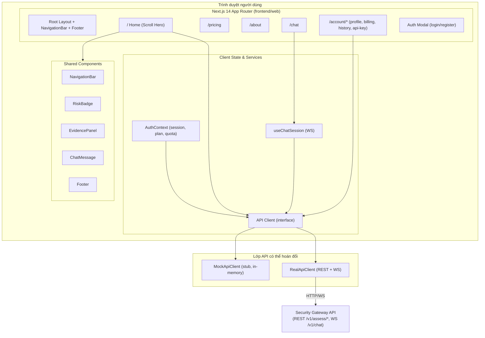
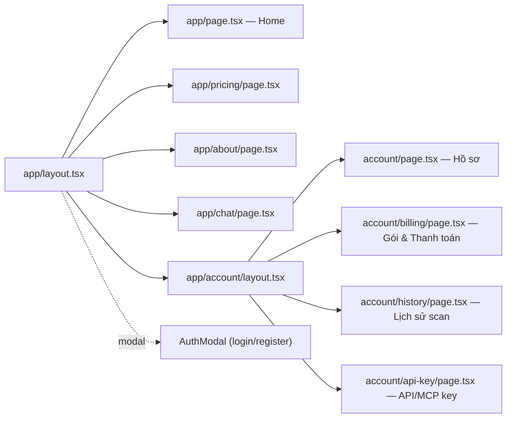
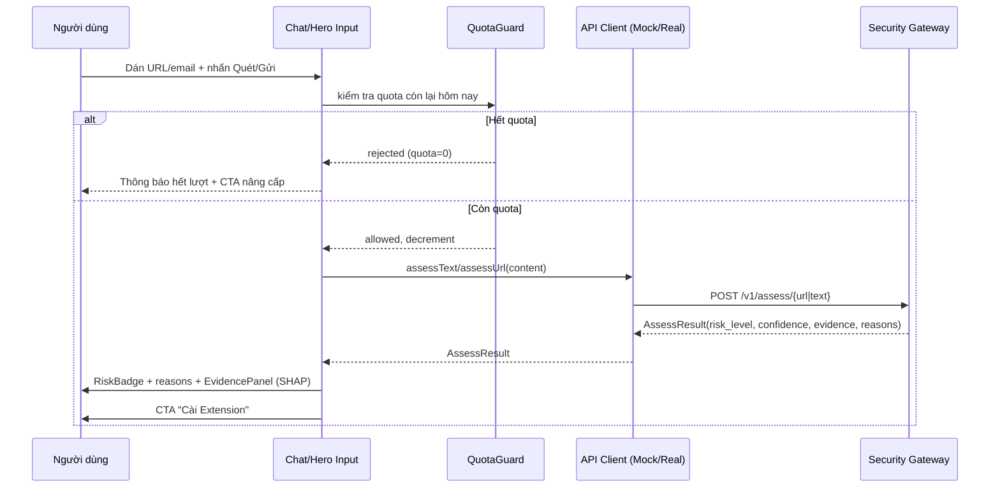
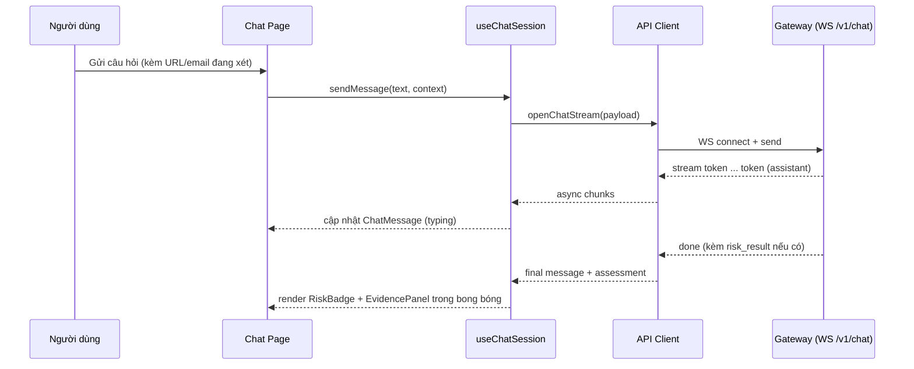

# Design Document: Web App UI — AI Security Armor

## Overview

Web App UI là **mặt tiền trình duyệt (browser-facing frontend)** của sản phẩm *AI Security Armor for Agentic Workflows*, xây bằng **Next.js 14 (App Router) + TailwindCSS + TypeScript** trong monorepo tại `frontend/web/`. Vai trò của web app theo triết lý sản phẩm: **"Web = thử nhanh, Extension/App = dùng thật"** — người dùng mới trải nghiệm nhanh khả năng đánh giá rủi ro (URL/email) qua Chat mà không cần cài đặt gì, sau đó được dẫn sang Chrome Extension để được bảo vệ tự động.

Web app gồm 5 trang công khai (Home/Landing, Pricing, About, Chat, Auth/Account) dùng chung `NavigationBar` và bộ component rủi ro (`RiskBadge`, `EvidencePanel`, `ChatMessage`). Toàn bộ nội dung hiển thị bằng **tiếng Việt** khớp với wireframe gốc. Trang Home nổi bật với **Hero "Scroll-driven Product Reveal"** (video demo warp theo phối cảnh laptop 3D, camera dolly-out theo % scroll).

Web app giao tiếp với backend **Security Gateway API** qua REST (`POST /v1/assess/url`, `/v1/assess/text`) và WebSocket (`/v1/chat`) để nhận `risk_level`, `confidence`, `evidence` (SHAP) và giải thích tiếng Việt. Vì backend có thể chưa chạy, thiết kế **bắt buộc có một lớp API client trừu tượng với mock/stub adapter** để UI demo được độc lập (standalone). Nguyên tắc xuyên suốt: **thang màu rủi ro nhất quán** (Xanh 0–39 / Vàng 40–69 / Đỏ 70–100) và **"luôn có vì sao"** (mọi điểm số kèm bằng chứng SHAP + giải thích ngôn ngữ tự nhiên).

> Phạm vi: CHỈ web frontend. Không bao gồm Chrome Extension, MCP Server, Desktop/Tauri, Mobile, hay backend ML. Các contract API được tham chiếu để dựng mock, không triển khai backend trong spec này.

## Architecture

### Sơ đồ kiến trúc frontend



### Luồng route (App Router)



### Quyết định kiến trúc & lý do

| Quyết định | Lý do |
|---|---|
| **Next.js 14 App Router** | Theo `repository-structure.md` (frontend/web). Server Components cho trang tĩnh (Pricing/About) tối ưu SEO; Client Components cho tương tác (Chat, Hero scroll). |
| **API Client là interface, có 2 impl** | Backend có thể chưa chạy → `MockApiClient` cho phép demo standalone; `RealApiClient` khi gateway sẵn sàng. Chọn qua biến môi trường `NEXT_PUBLIC_API_MODE`. |
| **Thang màu rủi ro tập trung 1 module** | `lib/risk.ts` là nguồn duy nhất map score → màu/verdict/nhãn, đảm bảo nhất quán giữa mọi component (giống Extension badge). |
| **Auth phía client (mock JWT)** | Demo không cần backend auth thật; `AuthContext` lưu session + plan + quota. Có thể thay bằng gọi API thật sau. |
| **Chat qua WebSocket, có fallback stream** | Contract backend là WS `/v1/chat` (RAG-like stream). Mock dùng async generator giả lập streaming từng token. |
| **Scroll Hero có graceful fallback** | Theo `landingpage.md.md`: thiết bị/mạng yếu → ảnh tĩnh + video thường, bỏ hiệu ứng scroll. |
| **Nội dung tiếng Việt** | Khớp wireframe; text tách vào `content/` để dễ bảo trì. |

## Sequence Diagrams

### Luồng 1: Quét nhanh từ Hero (Home) / Chat



### Luồng 2: Chat có ngữ cảnh (WebSocket stream)



### Luồng 3: Đăng nhập & tải dữ liệu tài khoản

```mermaid
sequenceDiagram
    participant U as Người dùng
    participant M as AuthModal
    participant Ctx as AuthContext
    participant API as API Client

    U->>M: Nhập email/mật khẩu → Đăng nhập
    M->>API: login(credentials)
    API-->>M: Session(token, user, plan)
    M->>Ctx: setSession(session)
    Ctx-->>U: Nav đổi sang Avatar ▾; đóng modal
    U->>API: (Account) getScanHistory(), getPlan()
    API-->>U: danh sách scan + thông tin gói
```

## Components and Interfaces

### Component: NavigationBar

**Purpose**: Thanh điều hướng dùng chung mọi trang; đổi trạng thái theo đăng nhập.

**Interface**:
```typescript
interface NavigationBarProps {
  currentPath: string;
  session: Session | null;      // null => hiện [Đăng nhập] [Dùng thử ▶]
  onOpenAuth: (mode: "login" | "register") => void;
  onLogout: () => void;
}
```

**Responsibilities**:
- Hiển thị logo + link `Home / Pricing / About / Chat`.
- Khi chưa đăng nhập: nút `[Đăng nhập]` `[Dùng thử ▶]`.
- Khi đã đăng nhập: `( Avatar ▾ )` với dropdown `Tài khoản / Lịch sử scan / Đăng xuất`.
- Đánh dấu link đang active theo `currentPath`.

### Component: RiskBadge

**Purpose**: Hiển thị nhãn rủi ro với màu theo thang chuẩn; dùng ở Chat, Hero, Lịch sử, Home.

**Interface**:
```typescript
interface RiskBadgeProps {
  score: number;                 // 0..100
  size?: "sm" | "md" | "lg";
  showScore?: boolean;           // hiển thị "94/100"
  showLabel?: boolean;           // hiển thị "RỦI RO CAO"
}
```

**Responsibilities**:
- Map `score` → `{ color, icon, label }` qua `lib/risk.ts` (nguồn duy nhất).
- Không tự tính ngưỡng riêng — luôn gọi `getRiskLevel(score)`.

### Component: EvidencePanel

**Purpose**: Hiển thị danh sách bằng chứng SHAP dạng thanh đóng góp + giải thích ngôn ngữ tự nhiên.

**Interface**:
```typescript
interface EvidencePanelProps {
  evidence: Evidence[];
  explanation?: string;          // giải thích tiếng Việt (Layer 2)
  collapsed?: boolean;           // "Xem đầy đủ bằng chứng (SHAP)"
  onToggle?: () => void;
}
```

**Responsibilities**:
- Sắp xếp evidence theo `severity` giảm dần.
- Vẽ thanh tỷ lệ đóng góp (dựa trên `contribution` nếu có, else theo severity).
- Trạng thái thu gọn/mở rộng.

### Component: ChatMessage

**Purpose**: Render một bong bóng hội thoại (user hoặc assistant); assistant có thể kèm kết quả đánh giá.

**Interface**:
```typescript
interface ChatMessageProps {
  message: ChatMessageModel;
  isStreaming?: boolean;         // hiển thị hiệu ứng đang gõ
}
```

**Responsibilities**:
- Phân biệt vai trò `user` / `assistant`.
- Nếu `message.assessment` tồn tại → nhúng `RiskBadge` + `EvidencePanel`.
- Hỗ trợ trạng thái streaming (con trỏ nhấp nháy).

### Component: Footer

**Purpose**: Chân trang dùng chung.

**Interface**:
```typescript
interface FooterProps { links?: FooterLink[]; }
interface FooterLink { label: string; href: string; }
```

### Component: ScrollHero (Home)

**Purpose**: Hero "Scroll-driven Product Reveal" theo `landingpage.md.md` (3 state: Intro → Scroll-driven → Idle).

**Interface**:
```typescript
interface ScrollHeroProps {
  videoSrc: string;              // video demo autoplay/loop
  frameManifest: string;         // đường dẫn image-sequence manifest
  cornerPinData: string;         // corner_pin.json cho warp
  onQuickScan: (input: string) => void;   // ô "Dán URL... [Quét]"
  reducedMotion?: boolean;       // fallback tĩnh
}

type HeroState = "intro" | "scroll_driven" | "idle";
```

**Responsibilities**:
- Quản lý state machine `intro → scroll_driven → idle`.
- Layer B: video demo chạy độc lập theo clock riêng (không do scroll điều khiển play/pause).
- Layer A: image sequence scrub theo `scrollProgress`; warp video bằng `matrix3d()` từ `cornerPinData`.
- Fallback khi `reducedMotion` hoặc thiết bị/mạng yếu: hiện frame tĩnh cuối + video thường, bỏ scroll effect.
- Nhúng ô quét nhanh + CTA `[Cài Chrome Extension]` `[Xem Demo 90 giây]`.

### Service: API Client (interface + 2 implementations)

**Purpose**: Trừu tượng hóa mọi lời gọi backend; cho phép hoán đổi Mock/Real.

**Interface**:
```typescript
interface ApiClient {
  assessUrl(url: string): Promise<AssessResult>;
  assessText(text: string, metadata?: AssessMetadata): Promise<AssessResult>;
  openChatStream(payload: ChatRequest): AsyncGenerator<ChatChunk, ChatFinal, void>;
  login(cred: Credentials): Promise<Session>;
  register(cred: RegisterInput): Promise<Session>;
  logout(): Promise<void>;
  getPlan(): Promise<PlanInfo>;
  getScanHistory(): Promise<ScanRecord[]>;
  getApiKey(): Promise<ApiKeyInfo>;
  rotateApiKey(): Promise<ApiKeyInfo>;
}
```

- `RealApiClient`: gọi REST `/v1/assess/*` + WS `/v1/chat`.
- `MockApiClient`: sinh kết quả tất định từ heuristic (homoglyph, HTTPS, TLD, urgency keywords) + streaming giả lập; lưu lịch sử/quota in-memory + `localStorage`.
- Lựa chọn qua `getApiClient()` đọc `NEXT_PUBLIC_API_MODE` (`mock` | `real`).

### Service: QuotaGuard

**Purpose**: Quản lý "còn lại hôm nay: X/Y scan" cho người dùng.

**Interface**:
```typescript
interface QuotaGuard {
  getRemaining(): number;
  canScan(): boolean;
  consume(): void;               // giảm 1, reset theo ngày
  getLimitForPlan(plan: PlanTier): number;   // Free=50, Pro=∞, Team=∞
}
```

## Data Models

### Model: RiskLevel & thang màu

```typescript
type RiskLevelKey = "safe" | "warn" | "danger";

interface RiskLevel {
  key: RiskLevelKey;
  label: string;                 // "AN TOÀN" | "ĐÁNG NGỜ" | "RỦI RO CAO"
  color: string;                 // token màu Tailwind
  icon: string;                  // "✅" | "⚠" | "⛔"
  min: number;                   // ngưỡng dưới (0/40/70)
  max: number;                   // ngưỡng trên (39/69/100)
}
```

**Validation Rules**:
- `score` hợp lệ trong `[0, 100]`.
- Thang: `safe` = 0–39, `warn` = 40–69, `danger` = 70–100 (khớp wireframe & Extension badge).
- Các khoảng phủ kín và không chồng lấn toàn bộ `[0,100]`.

### Model: Evidence

```typescript
type Severity = "info" | "low" | "medium" | "high" | "critical";

interface Evidence {
  source: string;                // "url_adapter" | "text_adapter" | ...
  message: string;               // tiếng Việt, mô tả bằng chứng
  severity: Severity;
  feature?: string;              // vd "homoglyph_score"
  contribution?: number;         // đóng góp SHAP (+0.38), tùy chọn
}
```

**Validation Rules**: `message` không rỗng; `severity` thuộc enum; nếu có `contribution` thì là số hữu hạn.

### Model: AssessResult

```typescript
interface AssessResult {
  score: number;                 // 0..100 (từ risk_score*100)
  riskLevel: RiskLevelKey;
  confidence: number;            // 0..1
  reasons: string[];             // "Lý do chính" tiếng Việt
  evidence: Evidence[];
  explanation?: string;          // giải thích ngôn ngữ tự nhiên (Layer 2)
  modality: "url" | "email" | "text";
  modelVersion?: string;
  latencyMs?: number;
  requestId: string;
}
```

**Validation Rules**: `score` ∈ [0,100]; `confidence` ∈ [0,1]; `riskLevel` phải nhất quán với `score` theo `getRiskLevel(score)`.

### Model: ChatMessageModel & Chat protocol

```typescript
interface ChatMessageModel {
  id: string;
  role: "user" | "assistant";
  text: string;
  createdAt: number;
  assessment?: AssessResult;     // gắn khi assistant trả kết quả đánh giá
}

interface ChatRequest {
  question: string;
  context?: { content: string; modality: "url" | "email" | "text" };
  history: ChatMessageModel[];
}

interface ChatChunk { delta: string; }
interface ChatFinal { messageId: string; assessment?: AssessResult; }
```

**Validation Rules**: `question` không rỗng sau khi trim; `history` giữ thứ tự thời gian tăng dần.

### Model: Session, PlanInfo, ScanRecord, ApiKeyInfo

```typescript
type PlanTier = "free" | "pro" | "team";

interface Session { token: string; user: UserProfile; plan: PlanInfo; }

interface UserProfile { id: string; email: string; displayName: string; avatarUrl?: string; }

interface PlanInfo {
  tier: PlanTier;                // free | pro | team
  label: string;                 // "FREE" | "PRO" | "TEAM"
  renewsAt?: string;             // "02/08/2026"
  dailyScanLimit: number;        // 50 | Infinity
}

interface ScanRecord {
  id: string;
  timestamp: string;             // "02/07 18:32"
  type: "URL" | "Email";
  score: number;                 // 0..100
  riskLevel: RiskLevelKey;
}

interface ApiKeyInfo { key: string; createdAt: string; }        // dùng cho Team/MCP
```

**Validation Rules**: `email` hợp lệ định dạng email; `dailyScanLimit` ≥ 0 (Pro/Team dùng `Number.POSITIVE_INFINITY`); `ScanRecord.score` ∈ [0,100].

### Model: PricingTier (Pricing page)

```typescript
interface PricingTier {
  id: PlanTier;
  name: string;                  // "FREE" | "PRO" | "TEAM / API"
  priceMonthly: number | null;   // null => "Liên hệ"
  priceYearly: number | null;
  highlighted: boolean;          // PRO ★ Phổ biến
  features: PricingFeature[];
  ctaLabel: string;              // "Bắt đầu" | "Dùng thử 7 ngày" | "Liên hệ"
}

interface PricingFeature { label: string; included: boolean; }  // ✓ / ✗
```

## Algorithmic Pseudocode

### Thuật toán: Map điểm rủi ro → mức + màu (nguồn duy nhất)

```pascal
ALGORITHM getRiskLevel(score)
INPUT: score (number)
OUTPUT: RiskLevel
BEGIN
  ASSERT score >= 0 AND score <= 100
  IF score <= 39 THEN
    RETURN RiskLevel{ key: "safe",   label: "AN TOÀN",    icon: "✅", min: 0,  max: 39 }
  ELSE IF score <= 69 THEN
    RETURN RiskLevel{ key: "warn",   label: "ĐÁNG NGỜ",   icon: "⚠",  min: 40, max: 69 }
  ELSE
    RETURN RiskLevel{ key: "danger", label: "RỦI RO CAO", icon: "⛔", min: 70, max: 100 }
  END IF
END
```

**Preconditions**: `0 ≤ score ≤ 100`.
**Postconditions**: trả đúng 1 mức; `result.min ≤ score ≤ result.max`; ánh xạ tất định.
**Loop Invariants**: N/A.

### Thuật toán: Quét nhanh có kiểm soát quota

```pascal
ALGORITHM quickScan(input, quota, apiClient)
INPUT: input (string), quota (QuotaGuard), apiClient (ApiClient)
OUTPUT: AssessResult hoặc QuotaError
BEGIN
  trimmed ← trim(input)
  IF trimmed = "" THEN
    RETURN ValidationError("Vui lòng nhập URL hoặc nội dung email")
  END IF

  IF NOT quota.canScan() THEN
    RETURN QuotaError("Đã hết lượt quét hôm nay")
  END IF

  modality ← IF looksLikeUrl(trimmed) THEN "url" ELSE "email"
  quota.consume()

  IF modality = "url" THEN
    result ← apiClient.assessUrl(trimmed)
  ELSE
    result ← apiClient.assessText(trimmed)
  END IF

  ASSERT result.riskLevel = getRiskLevel(result.score).key
  RETURN result
END
```

**Preconditions**: `apiClient` khởi tạo; `quota` phản ánh gói hiện tại.
**Postconditions**: nếu thành công, `result` khớp `AssessResult` và `riskLevel` nhất quán với `score`; quota giảm đúng 1 khi và chỉ khi một lần quét được thực thi.
**Loop Invariants**: N/A.

### Thuật toán: State machine của ScrollHero

```pascal
ALGORITHM heroStateMachine(scrollProgress, videoEndedOnce, userScrolled)
INPUT: scrollProgress (0..1), videoEndedOnce (bool), userScrolled (bool)
OUTPUT: HeroState + render side-effects
BEGIN
  state ← "intro"

  // STATE 0: INTRO — video full-screen, loop, chưa gắn canvas
  playVideoLoop()

  // Chuyển sang scroll_driven khi user bắt đầu scroll (once)
  IF userScrolled THEN
    state ← "scroll_driven"
    enableCanvasBackground()
  END IF

  // STATE 1: SCROLL_DRIVEN — scrub frame theo scroll, warp video
  IF state = "scroll_driven" THEN
    ASSERT 0 <= scrollProgress AND scrollProgress <= 1
    frameIndex ← floor(scrollProgress * (TOTAL_FRAMES - 1))
    drawBackgroundFrame(frameIndex)
    applyVideoWarp(cornerPin[frameIndex])
    IF scrollProgress >= 1 THEN
      state ← "idle"
      startIdleLoop()
    END IF
  END IF

  // STATE 2: IDLE — giữ frame cuối, video + idle anim loop độc lập
  RETURN state
END
```

**Preconditions**: assets (video, frames, corner_pin) đã preload theo chunk; nếu `reducedMotion` → bỏ qua toàn bộ, render fallback tĩnh.
**Postconditions**: state chỉ tiến `intro → scroll_driven → idle` (không lùi trong 1 phiên); video luôn play độc lập với play/pause do scroll.
**Loop Invariants**: `0 ≤ frameIndex ≤ TOTAL_FRAMES-1` mỗi lần vẽ.

### Thuật toán: MockApiClient.assessUrl (heuristic tất định)

```pascal
ALGORITHM mockAssessUrl(url)
INPUT: url (string)
OUTPUT: AssessResult
BEGIN
  evidence ← []
  score ← 5

  IF hasHomoglyph(url) THEN
    score ← score + 45
    evidence.add(Evidence{ source:"url_adapter", message:"Domain giả mạo thương hiệu (homoglyph)", severity:"critical", contribution:0.38 })
  END IF
  IF NOT startsWith(url, "https://") THEN
    score ← score + 20
    evidence.add(Evidence{ source:"url_adapter", message:"Không dùng HTTPS", severity:"medium", contribution:0.21 })
  END IF
  IF hasRiskyTld(url) THEN
    score ← score + 18
    evidence.add(Evidence{ source:"url_adapter", message:"TLD rủi ro cao", severity:"medium", contribution:0.17 })
  END IF
  IF contains(url, "login") THEN
    score ← score + 9
    evidence.add(Evidence{ source:"url_adapter", message:"Path chứa 'login'", severity:"low", contribution:0.09 })
  END IF

  score ← clamp(score, 0, 100)
  level ← getRiskLevel(score)
  RETURN AssessResult{
    score, riskLevel: level.key, confidence: 0.9, modality:"url",
    reasons: topReasons(evidence), evidence: sortBySeverity(evidence),
    requestId: uuid()
  }
END
```

**Preconditions**: `url` là chuỗi.
**Postconditions**: `score` ∈ [0,100]; `riskLevel` = `getRiskLevel(score).key`; tất định với cùng input.
**Loop Invariants**: sau mỗi lần cộng, `score` là số hữu hạn không âm trước khi clamp.

## Key Functions with Formal Specifications

### `getRiskLevel(score: number): RiskLevel`
**Preconditions**: `0 ≤ score ≤ 100`.
**Postconditions**: trả đúng một mức; `result.min ≤ score ≤ result.max`; hàm thuần, tất định.

### `formatScanTimestamp(date: Date): string`
**Preconditions**: `date` hợp lệ.
**Postconditions**: chuỗi dạng `"DD/MM HH:mm"`; không thay đổi `date`.

### `quickScan(input, quota, apiClient): Promise<AssessResult | AppError>`
**Preconditions**: dịch vụ khởi tạo.
**Postconditions**: input rỗng → `ValidationError`; hết quota → `QuotaError`; thành công → `AssessResult` nhất quán và quota giảm đúng 1.

### `sortEvidenceBySeverity(evidence: Evidence[]): Evidence[]`
**Preconditions**: mảng phần tử hợp lệ.
**Postconditions**: cùng đa tập phần tử (hoán vị) sắp xếp `severity` giảm dần; không mutate mảng gốc.
**Loop Invariants**: tiền tố đã duyệt luôn được sắp đúng thứ tự.

### `getScanQuotaRemaining(plan, usedToday): number`
**Preconditions**: `usedToday ≥ 0`.
**Postconditions**: Free → `max(0, 50 - usedToday)`; Pro/Team → `Infinity`; không âm.

## Example Usage

```typescript
// 1) Chọn API client theo môi trường
const api: ApiClient = getApiClient(); // mock khi NEXT_PUBLIC_API_MODE=mock

// 2) Quét nhanh từ Hero
async function onQuickScan(input: string) {
  const result = await quickScan(input, quota, api);
  if ("error" in result) return showError(result);
  setBadge(<RiskBadge score={result.score} showScore showLabel />);
  setEvidence(<EvidencePanel evidence={result.evidence} explanation={result.explanation} />);
}

// 3) Chat streaming có ngữ cảnh
const stream = api.openChatStream({
  question: "Vì sao homoglyph nặng?",
  context: { content: "http://vietc0mbank-secure.xyz/login", modality: "url" },
  history: messages,
});
for await (const chunk of stream) appendAssistantDelta(chunk.delta);

// 4) RiskBadge luôn dùng thang màu chung
<RiskBadge score={94} showScore showLabel />;   // ⛔ 94/100 — RỦI RO CAO
<RiskBadge score={12} showScore showLabel />;   // ✅ 12/100 — AN TOÀN
```

## Correctness Properties

*A property is a characteristic or behavior that should hold true across all valid executions of a system-essentially, a formal statement about what the system should do.*

### Property 1: Ánh xạ điểm → mức rủi ro nhất quán, phủ kín và tất định
*For any* `score` trong khoảng `[0, 100]`, `getRiskLevel(score)` trả đúng một mức (`safe`/`warn`/`danger`) với nhãn, icon, màu đúng theo thang chuẩn và `min ≤ score ≤ max`; hai lần gọi cùng một `score` luôn cho cùng kết quả.

**Validates: Requirements 1.1, 1.2, 1.3, 1.4, 1.5**

### Property 2: Badge phản ánh đúng thang màu
*For any* `score` hợp lệ, màu/icon/nhãn mà `RiskBadge` hiển thị bằng đúng với `getRiskLevel(score)` (badge không tự tính ngưỡng).

**Validates: Requirements 2.1, 2.4**

### Property 3: Kết quả đánh giá nhất quán nội tại và tất định
*For any* `AssessResult` trả về từ API client, `riskLevel === getRiskLevel(score).key`, `score ∈ [0,100]`, `confidence ∈ [0,1]`; với cùng một đầu vào, `MockApiClient` luôn trả cùng một `score`.

**Validates: Requirements 3.1, 3.2, 3.3, 3.4**

### Property 4: Quota giảm đúng một khi và chỉ khi quét thành công
*For any* trạng thái quota và input, một lần `quickScan` thành công làm quota giảm đúng 1; input rỗng/chỉ khoảng trắng hoặc hết quota không làm thay đổi quota và không gọi API.

**Validates: Requirements 6.1, 6.2, 6.3**

### Property 5: Sắp xếp bằng chứng bảo toàn phần tử
*For any* danh sách `Evidence`, `sortEvidenceBySeverity` trả về một hoán vị của danh sách gốc (cùng đa tập) theo thứ tự severity không tăng và không làm thay đổi mảng gốc.

**Validates: Requirements 4.1, 4.5**

### Property 6: State machine Hero chỉ tiến, không lùi
*For any* chuỗi sự kiện scroll trong một phiên, trạng thái Hero chỉ chuyển theo thứ tự `intro → scroll_driven → idle` và không quay lại trạng thái trước.

**Validates: Requirements 5.4**

### Property 7: Số quota còn lại đúng công thức và không âm
*For any* `usedToday ≥ 0`, số lượt còn lại của gói `free` bằng `max(0, 50 - usedToday)`; gói `pro`/`team` là vô hạn; kết quả luôn không âm.

**Validates: Requirements 7.1, 7.2, 7.3**

### Property 8: Chỉ số khung hình Hero luôn nằm trong biên
*For any* `scrollProgress ∈ [0,1]` khi ở trạng thái `scroll_driven`, chỉ số khung hình được vẽ luôn thỏa `0 ≤ frameIndex ≤ TOTAL_FRAMES-1`.

**Validates: Requirements 5.5**

### Property 9: Chọn modality theo dạng đầu vào
*For any* chuỗi đầu vào không rỗng, `quickScan` chọn modality `url` khi và chỉ khi đầu vào trông giống URL, ngược lại chọn `email`.

**Validates: Requirements 6.4**

### Property 10: canScan tương đương còn lượt
*For any* trạng thái quota, `canScan()` trả về true khi và chỉ khi số lượt còn lại lớn hơn 0.

**Validates: Requirements 7.5**

### Property 11: Round-trip định dạng thời gian scan
*For any* `Date` hợp lệ, chuỗi do `formatScanTimestamp` sinh ra khớp dạng `"DD/MM HH:mm"`, và đọc lại chuỗi đó bảo toàn thông tin ngày/tháng/giờ/phút (bỏ giây).

**Validates: Requirements 14.3, 14.4**

## Error Handling

### Backend không sẵn sàng (mock fallback)
**Condition**: Gateway không phản hồi hoặc `NEXT_PUBLIC_API_MODE=mock`.
**Response**: `getApiClient()` trả `MockApiClient`; UI hoạt động đầy đủ với dữ liệu giả lập.
**Recovery**: Khi gateway sẵn sàng, đổi env → dùng `RealApiClient` không cần sửa UI.

### WebSocket chat mất kết nối
**Condition**: WS `/v1/chat` đóng giữa chừng.
**Response**: hiển thị thông báo "Mất kết nối, đang thử lại"; giữ lịch sử hội thoại.
**Recovery**: tự reconnect với backoff; nếu thất bại, cho gửi lại tin nhắn cuối.

### LLM timeout (thiếu explanation)
**Condition**: Layer 2 không trả `explanation` trong thời hạn.
**Response**: vẫn hiển thị `RiskBadge` + `reasons` + `EvidencePanel`; ẩn phần giải thích ngôn ngữ tự nhiên hoặc dùng template fallback.
**Recovery**: cho phép người dùng bấm "Tạo lại giải thích".

### Hết quota quét
**Condition**: `quota.canScan() === false`.
**Response**: chặn quét, hiển thị "Đã hết lượt hôm nay (X/Y)" + CTA nâng cấp/cài Extension.
**Recovery**: quota reset theo ngày; nâng gói Pro → không giới hạn.

### Input không hợp lệ
**Condition**: input rỗng/chỉ khoảng trắng.
**Response**: thông báo validation, không gọi API, không giảm quota.
**Recovery**: người dùng nhập lại.

### Thiết bị/mạng yếu (Hero)
**Condition**: `reducedMotion` bật hoặc không đủ hiệu năng/băng thông.
**Response**: bỏ scroll effect, hiển thị frame tĩnh cuối + video thường.
**Recovery**: N/A (đây là chế độ hạ cấp có chủ đích).

## Testing Strategy

### Unit Testing Approach
- Test các hàm thuần: `getRiskLevel`, `sortEvidenceBySeverity`, `formatScanTimestamp`, `getScanQuotaRemaining`, `looksLikeUrl`.
- Test render component với React Testing Library: `RiskBadge` (màu/nhãn theo score), `EvidencePanel` (sắp xếp + toggle), `ChatMessage` (streaming, nhúng assessment), `NavigationBar` (đổi trạng thái đăng nhập).
- Test `MockApiClient` tính tất định và khớp schema `AssessResult`.

### Property-Based Testing Approach
- Kiểm chứng các property phổ quát ở mục Correctness Properties (thang màu, nhất quán kết quả, quota, sắp xếp evidence, state machine Hero, round-trip thời gian).
- **Property Test Library**: **fast-check** (TypeScript), tối thiểu 100 iterations/property.
- Generators: `score` ∈ [0,100], mảng `Evidence` ngẫu nhiên, chuỗi URL/email ngẫu nhiên, `Date` ngẫu nhiên, chuỗi sự kiện scroll.

### Integration Testing Approach
- Test luồng quét từ Hero/Chat với `MockApiClient` (render kết quả đúng).
- Test đăng nhập → Nav đổi trạng thái → Account tải lịch sử.
- Test fallback WS bằng mock stream (async generator).

## Performance Considerations
- Hero: preload asset theo chunk; mục tiêu Intro < 1.5s, scroll ≥ 30fps trên mobile tầm trung; fallback tĩnh khi yếu (theo `landingpage.md.md`).
- Trang Pricing/About render tĩnh (Server Components) để tối ưu tải & SEO.
- Chat: cập nhật DOM theo delta streaming, tránh re-render toàn bộ danh sách.

## Security Considerations
- Không render nội dung độc hại: kết quả đánh giá chỉ hiển thị mô tả/bằng chứng, không nhúng link sống trong khu vực nội dung độc hại.
- API key (Team/MCP) hiển thị dạng che một phần, có nút sao chép/rotate; không log ra console.
- Sanitize mọi văn bản người dùng trước khi render (dùng `textContent`/JSX escaping, tránh `dangerouslySetInnerHTML`).
- Auth token lưu ở nơi phù hợp (memory + httpOnly khi có backend thật); mock token không phải bí mật thực.

## Dependencies
- **Next.js 14** (App Router), **React 18**, **TypeScript**.
- **TailwindCSS** (+ tokens màu rủi ro).
- **fast-check** (property-based testing), **Vitest** + **React Testing Library** (unit/component).
- (Tùy chọn Hero) **GSAP ScrollTrigger** cho scroll scrubbing; Canvas/WebGL cho image sequence.
- Contract types đồng bộ từ `shared/schemas` (tham chiếu; sinh TS interface).
