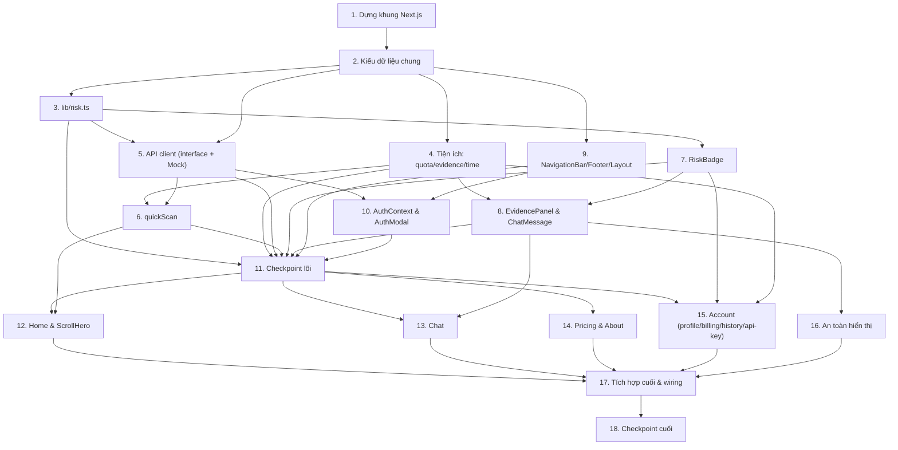

# Implementation Plan

## Web App UI — AI Security Armor

## Overview

Kế hoạch xây dựng **Web App UI** bằng **Next.js 14 (App Router) + TypeScript + TailwindCSS** tại `frontend/web/`. Các task được sắp xếp tăng dần: dựng khung → module lõi rủi ro → lớp API (interface + mock) → component dùng chung → từng trang → tài khoản → tích hợp & kiểm thử. Mỗi task tham chiếu requirements cụ thể. Kiểm thử theo thuộc tính dùng **fast-check**, kiểm thử unit/component dùng **Vitest + React Testing Library** (tối thiểu 100 iterations/property).

## Task Dependency Graph



```json
{
  "waves": [
    { "wave": 1, "tasks": ["1"] },
    { "wave": 2, "tasks": ["2"] },
    { "wave": 3, "tasks": ["3", "4"] },
    { "wave": 4, "tasks": ["5"] },
    { "wave": 5, "tasks": ["6", "7", "9"] },
    { "wave": 6, "tasks": ["8", "10"] },
    { "wave": 7, "tasks": ["11"] },
    { "wave": 8, "tasks": ["12", "13", "14", "15", "16"] },
    { "wave": 9, "tasks": ["17"] },
    { "wave": 10, "tasks": ["18"] }
  ]
}
```

## Tasks

- [x] 1. Dựng khung dự án Next.js 14 và cấu hình nền tảng
  - Khởi tạo `frontend/web/` với Next.js 14 App Router + TypeScript (`app/`, `tsconfig.json`, `next.config.js`, `package.json`).
  - Cấu hình TailwindCSS (`tailwind.config.ts`, `postcss.config.js`, `app/globals.css`) với **design token màu rủi ro** (safe/xanh, warn/vàng, danger/đỏ).
  - Cài Vitest + React Testing Library + fast-check; thêm script test và `vitest.config.ts` (jsdom).
  - Tạo biến môi trường `NEXT_PUBLIC_API_MODE` (mock|real) và file `.env.example`.
  - _Requirements: 16.1, 16.2_

- [x] 2. Định nghĩa kiểu dữ liệu chung
  - Tạo `lib/types.ts` với các interface: `RiskLevel`, `RiskLevelKey`, `Evidence`, `Severity`, `AssessResult`, `ChatMessageModel`, `ChatRequest`, `ChatChunk`, `ChatFinal`, `Session`, `UserProfile`, `PlanInfo`, `PlanTier`, `ScanRecord`, `ApiKeyInfo`, `PricingTier`, `PricingFeature`.
  - _Requirements: 3.5, 9.1_

- [x] 3. Module thang màu rủi ro (nguồn duy nhất)
  - [x] 3.1 Hiện thực `lib/risk.ts`
    - Viết `getRiskLevel(score)` map [0–39]→safe, [40–69]→warn, [70–100]→danger kèm label/icon/màu; ném lỗi khi score ngoài [0,100].
    - Định nghĩa bảng token màu Tailwind cho từng mức để component tái sử dụng.
    - _Requirements: 1.1, 1.2, 1.3, 1.4, 1.5, 1.6_
  - [x]* 3.2 Property test cho ánh xạ thang màu
    - **Property 1: Ánh xạ điểm → mức rủi ro nhất quán, phủ kín và tất định**
    - **Validates: Requirements 1.1, 1.2, 1.3, 1.4, 1.5**
  - [x]* 3.3 Unit test edge case cho `getRiskLevel`
    - Test biên 0, 39, 40, 69, 70, 100 và score ngoài [0,100] ném lỗi.
    - _Requirements: 1.6_

- [x] 4. Tiện ích thuần: quota, sắp xếp evidence, thời gian
  - [x] 4.1 Hiện thực `lib/quota.ts` (`QuotaGuard`)
    - `getRemaining`, `canScan`, `consume`, `getLimitForPlan`, `getScanQuotaRemaining(plan, usedToday)`; reset theo ngày; Free=50, Pro/Team=∞.
    - _Requirements: 7.1, 7.2, 7.3, 7.4, 7.5_
  - [x]* 4.2 Property test cho số quota còn lại
    - **Property 7: Số quota còn lại đúng công thức và không âm**
    - **Validates: Requirements 7.1, 7.2, 7.3**
  - [x]* 4.3 Property test cho canScan
    - **Property 10: canScan tương đương còn lượt**
    - **Validates: Requirements 7.5**
  - [x] 4.4 Hiện thực `lib/evidence.ts` (`sortEvidenceBySeverity`) và `lib/time.ts` (`formatScanTimestamp`)
    - Sắp xếp evidence theo severity giảm dần, không mutate; định dạng thời gian "DD/MM HH:mm".
    - _Requirements: 4.1, 4.5, 14.3, 14.4_
  - [x]* 4.5 Property test cho sắp xếp evidence
    - **Property 5: Sắp xếp bằng chứng bảo toàn phần tử**
    - **Validates: Requirements 4.1, 4.5**
  - [x]* 4.6 Property test round-trip thời gian
    - **Property 11: Round-trip định dạng thời gian scan**
    - **Validates: Requirements 14.3, 14.4**

- [x] 5. Lớp API client (interface + Mock)
  - [x] 5.1 Định nghĩa interface `ApiClient` tại `lib/api/client.ts` và `getApiClient()` tại `lib/api/index.ts`
    - Khai báo đầy đủ phương thức (`assessUrl`, `assessText`, `openChatStream`, `login`, `register`, `logout`, `getPlan`, `getScanHistory`, `getApiKey`, `rotateApiKey`).
    - `getApiClient()` chọn impl theo `NEXT_PUBLIC_API_MODE`.
    - _Requirements: 16.1, 16.2, 16.3, 16.5_
  - [x] 5.2 Hiện thực `MockApiClient` tại `lib/api/mock.ts`
    - Viết `mockAssessUrl`/`assessText` theo heuristic tất định (homoglyph, HTTPS, TLD, urgency); `looksLikeUrl`; đảm bảo `riskLevel === getRiskLevel(score).key`, clamp [0,100].
    - Giả lập `openChatStream` bằng async generator (stream token); login/register/logout mock JWT; lưu lịch sử scan + quota vào memory + `localStorage`.
    - _Requirements: 3.1, 3.2, 3.3, 3.4, 3.5, 16.3, 16.4_
  - [x]* 5.3 Property test nhất quán nội tại của AssessResult
    - **Property 3: Kết quả đánh giá nhất quán nội tại và tất định**
    - **Validates: Requirements 3.1, 3.2, 3.3, 3.4**
  - [x] 5.4 Tạo stub `RealApiClient` tại `lib/api/real.ts`
    - Khung gọi REST `/v1/assess/*` và WS `/v1/chat` cùng interface (chưa cần backend thật).
    - _Requirements: 16.2, 16.3_

- [x] 6. Hàm quét nhanh có kiểm soát quota
  - [x] 6.1 Hiện thực `lib/quick-scan.ts` (`quickScan`)
    - Trim + validate rỗng → ValidationError (không gọi API, không giảm quota); hết quota → QuotaError; chọn modality; giảm quota đúng 1 khi quét; kiểm chứng `riskLevel` nhất quán.
    - _Requirements: 6.1, 6.2, 6.3, 6.4_
  - [x]* 6.2 Property test quota giảm đúng một khi quét thành công
    - **Property 4: Quota giảm đúng một khi và chỉ khi quét thành công**
    - **Validates: Requirements 6.1, 6.2, 6.3**
  - [x]* 6.3 Property test chọn modality theo đầu vào
    - **Property 9: Chọn modality theo dạng đầu vào**
    - **Validates: Requirements 6.4**

- [x] 7. Component RiskBadge
  - [x] 7.1 Hiện thực `components/RiskBadge.tsx`
    - Lấy màu/icon/nhãn từ `getRiskLevel`; hỗ trợ `size`, `showScore` ("X/100"), `showLabel`.
    - _Requirements: 2.1, 2.2, 2.3, 2.4, 2.5_
  - [x]* 7.2 Property test badge khớp thang màu
    - **Property 2: Badge phản ánh đúng thang màu**
    - **Validates: Requirements 2.1, 2.4**
  - [x]* 7.3 Unit test render RiskBadge
    - Test `showScore`, `showLabel`, `size` (sm/md/lg).
    - _Requirements: 2.2, 2.3, 2.5_

- [x] 8. Component EvidencePanel & ChatMessage
  - [x] 8.1 Hiện thực `components/EvidencePanel.tsx`
    - Sắp xếp qua `sortEvidenceBySeverity`; vẽ thanh đóng góp (contribution/severity); hiển thị `explanation`; toggle thu gọn/mở rộng.
    - _Requirements: 4.1, 4.2, 4.3, 4.4_
  - [x] 8.2 Hiện thực `components/ChatMessage.tsx`
    - Phân biệt vai trò user/assistant; trạng thái streaming (con trỏ nhấp nháy); nhúng `RiskBadge` + `EvidencePanel` khi có `assessment`.
    - _Requirements: 8.2, 8.3, 8.6_
  - [x]* 8.3 Unit test EvidencePanel & ChatMessage
    - Test sắp xếp/hiển thị explanation/toggle; render 2 vai trò; nhúng assessment.
    - _Requirements: 4.2, 4.3, 4.4, 8.3, 8.6_

- [x] 9. NavigationBar, Footer & Root Layout
  - [x] 9.1 Hiện thực `components/NavigationBar.tsx` và `components/Footer.tsx`
    - Nav: logo + link Home/Pricing/About/Chat, đánh dấu active theo path; chưa đăng nhập → nút "Đăng nhập"/"Dùng thử ▶"; đã đăng nhập → Avatar ▾ dropdown.
    - Footer: danh sách link chân trang.
    - _Requirements: 17.1, 17.2, 17.3, 17.4, 17.5_
  - [x] 9.2 Hiện thực `app/layout.tsx` gắn NavigationBar + Footer + AuthContext provider
    - Bọc toàn ứng dụng; render Nav/Footer trên mọi trang.
    - _Requirements: 17.1, 17.5_
  - [x]* 9.3 Unit test NavigationBar theo trạng thái đăng nhập & active link
    - _Requirements: 17.2, 17.3, 17.4_

- [x] 10. AuthContext & AuthModal
  - [x] 10.1 Hiện thực `context/AuthContext.tsx`
    - Lưu session/plan/quota; `setSession`, `logout`; đọc/ghi localStorage; cung cấp hook `useAuth`.
    - _Requirements: 11.2, 11.3_
  - [x] 10.2 Hiện thực `components/AuthModal.tsx`
    - Form login/register; validate định dạng email trước khi gọi API; gọi `api.login`/`api.register`; cập nhật context; hiển thị lỗi.
    - _Requirements: 11.1, 11.4, 11.5_
  - [x]* 10.3 Unit test AuthModal validation & luồng đăng nhập/đăng xuất
    - Test email không hợp lệ không gọi API; login set context + Nav đổi; logout xóa session.
    - _Requirements: 11.1, 11.2, 11.3, 11.4, 11.5_

- [x] 11. Checkpoint — đảm bảo lõi & component vượt qua test
  - Ensure all tests pass, ask the user if questions arise.

- [x] 12. Trang Home & ScrollHero
  - [x] 12.1 Hiện thực `components/ScrollHero.tsx`
    - State machine `intro → scroll_driven → idle` (chỉ tiến, không lùi); scrub frame theo scrollProgress với `frameIndex` trong [0, TOTAL_FRAMES-1]; warp video; fallback tĩnh khi `reducedMotion`/thiết bị yếu.
    - _Requirements: 5.1, 5.2, 5.3, 5.4, 5.5, 5.6_
  - [x] 12.2 Hiện thực `app/page.tsx` (Home)
    - Nhúng ScrollHero + ô quét nhanh (gọi `quickScan`) + CTA "Cài Chrome Extension"/"Xem Demo 90 giây"; hiển thị RiskBadge + reasons + EvidencePanel + CTA "Cài Extension" khi có kết quả.
    - _Requirements: 5.7, 6.1, 6.5_
  - [x]* 12.3 Property test state machine Hero chỉ tiến
    - **Property 6: State machine Hero chỉ tiến, không lùi**
    - **Validates: Requirements 5.4**
  - [x]* 12.4 Property test biên chỉ số khung hình Hero
    - **Property 8: Chỉ số khung hình Hero luôn nằm trong biên**
    - **Validates: Requirements 5.5**
  - [x]* 12.5 Unit test Home & fallback reducedMotion
    - Test trạng thái intro, có ô quét + CTA; reducedMotion → fallback tĩnh.
    - _Requirements: 5.1, 5.6, 5.7_

- [x] 13. Trang Chat (streaming có ngữ cảnh)
  - [x] 13.1 Hiện thực hook `hooks/useChatSession.ts`
    - Mở luồng qua `api.openChatStream`; cập nhật ChatMessage theo delta; xử lý mất kết nối WS (thông báo, giữ lịch sử, reconnect backoff).
    - _Requirements: 8.1, 8.5_
  - [x] 13.2 Hiện thực `app/chat/page.tsx`
    - Danh sách ChatMessage; ô nhập + gửi; validate câu hỏi rỗng không gửi; hiển thị typing khi stream; nhúng RiskBadge + EvidencePanel khi có assessment.
    - _Requirements: 8.1, 8.2, 8.3, 8.4, 8.6_
  - [x]* 13.3 Integration test luồng chat bằng mock stream
    - Test gửi câu hỏi → nhận chunk → final kèm assessment; câu hỏi rỗng bị chặn; mô phỏng WS đóng → thông báo + giữ lịch sử.
    - _Requirements: 8.1, 8.3, 8.4, 8.5_

- [x] 14. Trang Pricing & About
  - [x] 14.1 Hiện thực `app/pricing/page.tsx`
    - Dữ liệu `PricingTier` (FREE/PRO/TEAM); giá tháng/năm hoặc "Liên hệ" (null); nổi bật gói highlighted; features ✓/✗; nhãn CTA.
    - _Requirements: 9.1, 9.2, 9.3, 9.4_
  - [x] 14.2 Hiện thực `app/about/page.tsx` (Server Component tĩnh)
    - Nội dung giới thiệu tiếng Việt; render tĩnh tối ưu SEO.
    - _Requirements: 10.1, 10.2_
  - [x]* 14.3 Unit test Pricing render tiers/giá/features/CTA
    - _Requirements: 9.1, 9.2, 9.3, 9.4_

- [x] 15. Khu vực Tài khoản (profile, billing, history, api-key)
  - [x] 15.1 Hiện thực `app/account/layout.tsx` + guard yêu cầu đăng nhập
    - Bảo vệ route: chưa đăng nhập → yêu cầu đăng nhập trước khi hiển thị.
    - _Requirements: 12.2_
  - [x] 15.2 Hiện thực `app/account/page.tsx` (Hồ sơ)
    - Hiển thị email + tên hiển thị từ session.
    - _Requirements: 12.1_
  - [x] 15.3 Hiện thực `app/account/billing/page.tsx` (Gói & Thanh toán)
    - Hiển thị tên gói, ngày gia hạn, giới hạn quét hằng ngày theo gói.
    - _Requirements: 13.1, 13.2_
  - [x] 15.4 Hiện thực `app/account/history/page.tsx` (Lịch sử scan)
    - Bảng ScanRecord (thời điểm qua `formatScanTimestamp`, loại, điểm, mức) mỗi dòng kèm RiskBadge.
    - _Requirements: 14.1, 14.2, 14.3_
  - [x] 15.5 Hiện thực `app/account/api-key/page.tsx` (API/MCP key)
    - Hiển thị key che một phần; nút sao chép; nút tạo lại (gọi `rotateApiKey`); không log key ra console.
    - _Requirements: 15.1, 15.2, 15.3_
  - [x]* 15.6 Unit test các trang Account
    - Test guard đăng nhập; hiển thị hồ sơ/billing/history; key che + rotate.
    - _Requirements: 12.1, 12.2, 13.1, 13.2, 14.1, 14.2, 15.1, 15.2_

- [x] 16. An toàn hiển thị nội dung
  - [x] 16.1 Áp dụng sanitize hiển thị nội dung do người dùng cung cấp
    - Dùng escaping JSX/`textContent`; không dùng `dangerouslySetInnerHTML` cho nội dung người dùng; không nhúng link sống trong khu vực nội dung độc hại (render link inert).
    - _Requirements: 18.1, 18.2, 18.3_
  - [x]* 16.2 Unit test an toàn hiển thị
    - Inject chuỗi HTML/script → render dạng text; xác nhận link trong vùng độc hại là inert.
    - _Requirements: 18.1, 18.3_

- [x] 17. Tích hợp cuối & wiring
  - [x] 17.1 Kết nối `getApiClient()`, AuthContext, QuotaGuard vào toàn bộ các trang
    - Đảm bảo Home/Chat/Account dùng chung một API client và context; đổi `NEXT_PUBLIC_API_MODE` không cần sửa UI.
    - _Requirements: 16.1, 16.2, 16.5_
  - [x]* 17.2 Integration test luồng đăng nhập → Nav đổi → Account tải lịch sử
    - _Requirements: 11.2, 14.1_

- [x] 18. Checkpoint cuối — đảm bảo toàn bộ test vượt qua
  - Ensure all tests pass, ask the user if questions arise.

## Notes

- Task gắn hậu tố `*` là kiểm thử (tùy chọn cho MVP nhanh); task lõi không được đánh dấu `*`.
- Mỗi task tham chiếu requirements để truy vết.
- Property test dùng **fast-check** (≥100 iterations), unit/component test dùng **Vitest + React Testing Library**.
- Mỗi property test tham chiếu đúng property trong `design.md`.
